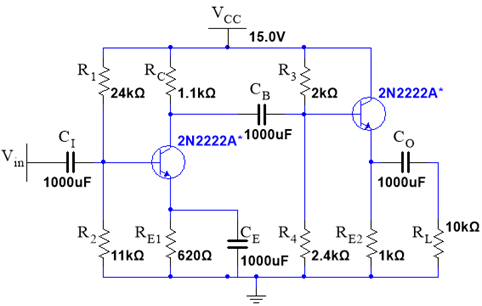
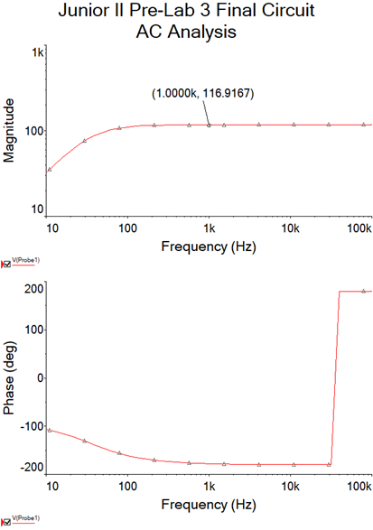
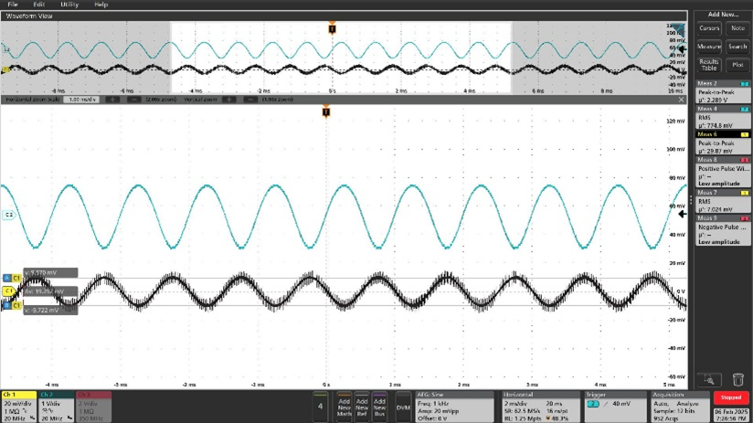

# Multi-Stage BJT Amplifier Design

This project presents the design and analysis of a two-stage BJT amplifier using 2N2222A transistors, achieving high voltage gain while maintaining signal integrity and proper impedance matching.

## Overview

The amplifier consists of two stages:

1. Common-emitter amplifier (voltage gain)  
2. Emitter follower (impedance matching and current gain)  

The design ensures high overall gain while maintaining low output impedance and stable operation.

---

## System Architecture

- Common-emitter stage for voltage amplification  
- Emitter follower stage for buffering  
- Biasing network for stable Q-point  
- Coupling capacitors for AC signal transfer  

---

## Circuit Design

The circuit shows the full two-stage amplifier, combining voltage gain and impedance matching.

---

## Gain Performance

The amplifier achieves a voltage gain well above the required threshold (|Av| > 100), with a stable mid-band region.

---

## Signal Amplification

The output signal shows clear amplification compared to the input, confirming correct multi-stage operation.

---

## Key Results

- Voltage gain > 100  
- Input resistance > 600 Ω  
- Output resistance < 8 Ω  
- Stable biasing and operation  

---

## Files

- `docs/multi-stage-bjt-amplifier.pdf` — full design report and analysis  

---

## Skills Demonstrated

- Analog circuit design  
- BJT amplifier design  
- Biasing and stability analysis  
- Frequency response analysis  
- Signal amplification and validation  

---

## Why This Project Matters

This project demonstrates core analog design principles used in real-world amplifiers, including gain staging, impedance matching, and frequency response control.

---

## Author

Joshua Oliveira